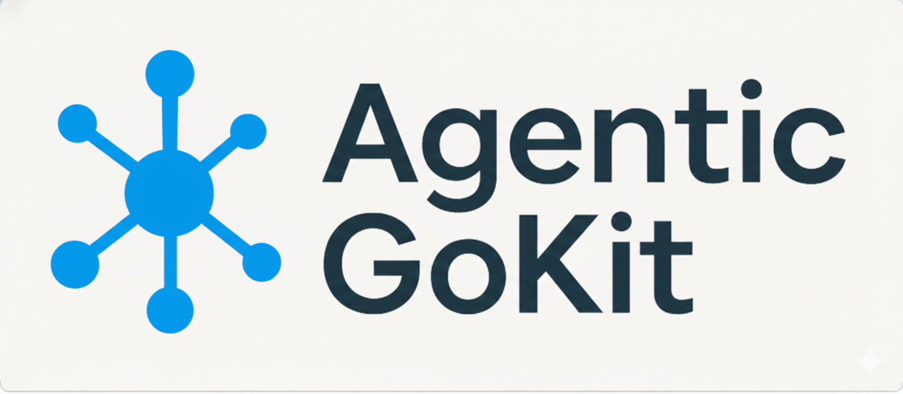

<div align="center">
  
  <h1>AgenticGoKit Templates Registry</h1>
  <p>
    <b>The official registry for AgenticGoKit templates and agentic workflows.</b>
  </p>
  <p>
    <a href="https://github.com/AgenticGoKit/agk">AGK Tool</a> •
    <a href="https://github.com/AgenticGoKit/AgenticGoKit">AgenticGoKit Framework</a> •
    <a href="#-submitting-a-template">Contribute</a>
  </p>
</div>

---

## 🚀 Getting Started

Discover and adopt agentic patterns instantly using the `agk` CLI.

### 1. Install the CLI
```bash
go install github.com/AgenticGoKit/agk@latest
```

### 2. Initialize a Template
Use `agk init` followed by your desired agent name and the template flag.

```bash
agk init <agent-name> -t agk/<template-name>
```

---

## 📦 Available Templates

Explore the collection of official templates designed to jumpstart your agentic development.

| Template | Description | Quick Start |
| :--- | :--- | :--- |
| **[test-agent](https://github.com/agk-templates/test-agent)** | A basic agent implementation to verify your setup and connectivity. | `agk init my-agent -t agk/test-agent` |
| **[translate-workflow](https://github.com/agk-templates/translate-workflow)** | Config-driven translation workflow (detect → translate → QA). | `agk init my-translate -t agk/translate-workflow` |
| **[flight-search-assistant](https://github.com/agk-templates/flight-search-assistant)** | Config-driven flight search assistant with tool calling. | `agk init my-flight -t agk/flight-search-assistant` |

> *More templates coming soon!*

---

## ➕ Submitting a Template

We welcome contributions! To submit a new template:

We welcome contributions! Please refer to our [Creating Templates Guide](https://github.com/agk-templates/.github/blob/main/creating-templates.md) for detailed instructions on how to create and register a new template.

---

<div align="center">
  <sub>Built with ❤️ by the AgenticGoKit Team</sub>
</div>
